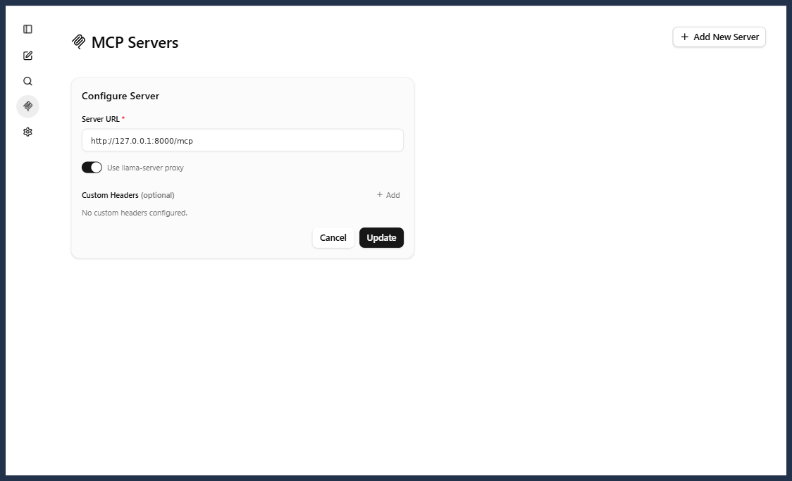
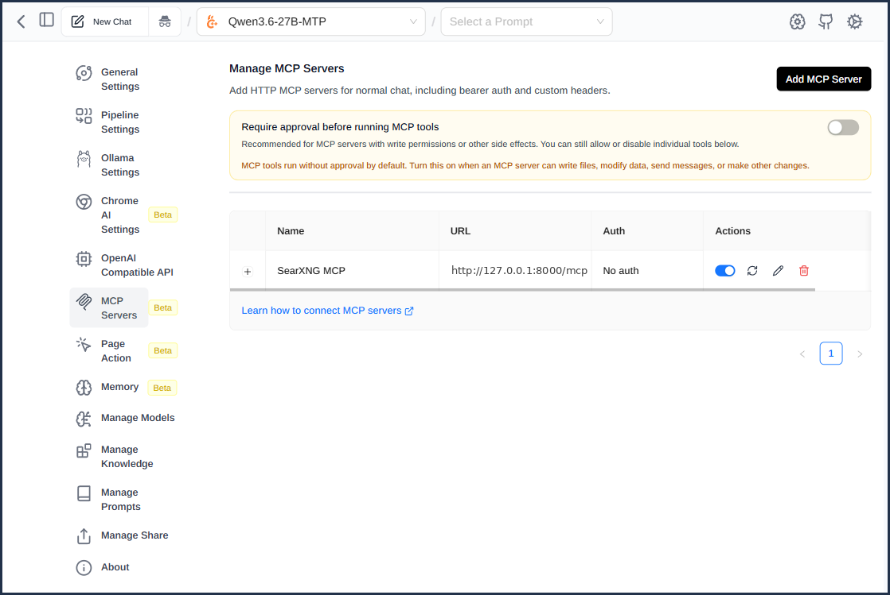

<p align="center">
  
</p>

# searxng-mcp-bridge

A minimal [MCP](https://modelcontextprotocol.io/) server that exposes a private
[SearXNG](https://github.com/searxng/searxng) instance as a `search` tool over
**streamable-HTTP**, so it can be used as a web-search tool from the
[llama.cpp](https://github.com/ggml-org/llama.cpp) WebUI (or any MCP client that
speaks streamable-HTTP / SSE).

It is deliberately tiny — one file, two dependencies (`fastmcp`, `httpx`) — as an
auditable alternative to heavier SearXNG MCP packages.

## Why this exists

There are existing SearXNG MCP servers, so why another one? Two reasons specific
to this use case:

- **Transport.** The llama.cpp WebUI is a browser-based MCP client, so it can
  only talk to MCP servers over a network transport (streamable-HTTP / SSE /
  WebSocket) — not stdio. Many published SearXNG MCP servers are stdio-first
  (aimed at Claude Desktop / IDEs), which doesn't fit here.
- **Footprint.** This service runs unauthenticated on the local network, so its
  dependency and supply-chain surface matters. The most prominent PyPI option
  (`searxng-mcp`) pulls in **~167 transitive packages** — including `litellm`,
  `llama-index-core`, `confluent-kafka`, and a number of the author's own
  utility packages — for what is ultimately a thin wrapper around one HTTP
  endpoint. That's a lot of unrelated code to trust and keep updated.

Since the actual job is trivial (forward a query to SearXNG's JSON API and return
the results), a single readable file with two well-known dependencies is easier
to audit, deploy, and reason about than adopting a large general-purpose package.

## How it works

```
llama.cpp WebUI (browser MCP client)
        │  streamable-HTTP  http://<host>:8000/mcp
        ▼
   server.py  (this bridge)
        │  GET /search?format=json
        ▼
   SearXNG  http://127.0.0.1:4000
```

The WebUI's MCP client is browser-based and only supports network transports
(streamable-HTTP / SSE / WebSocket) — not stdio — which is why this bridge serves
HTTP.

## Tool

`search(query, max_results=10, categories=None, language=None, time_range=None)`
— returns a list of `{title, url, content, engine}` from SearXNG.

## Configuration (env vars)

| Var           | Default                  | Meaning                         |
|---------------|--------------------------|---------------------------------|
| `SEARXNG_URL` | `http://127.0.0.1:4000`  | Base URL of the SearXNG instance |
| `HOST`        | `0.0.0.0`                | Bind address                    |
| `PORT`        | `8000`                   | Listen port                     |
| `MCP_PATH`    | `/mcp`                   | HTTP path for the MCP endpoint  |

SearXNG must have the JSON format enabled (`search.formats` includes `json` in
`settings.yml`).

## Install (systemd)

```bash
git clone <this-repo> /opt/searxng-mcp
cd /opt/searxng-mcp
./install.sh            # creates .venv, installs the unit, enables + starts it
```

`install.sh` rewrites the unit's paths/user to wherever the repo lives. Override
the interpreter or service user with `PYTHON=`, `SERVICE_USER=`, `SERVICE_GROUP=`.

Manage it:

```bash
sudo systemctl restart searxng-mcp
journalctl -u searxng-mcp -f
```

## Run manually (dev)

```bash
python3 -m venv .venv && .venv/bin/pip install -r requirements.txt
SEARXNG_URL=http://127.0.0.1:4000 .venv/bin/python server.py
```

## Wire into the llama.cpp WebUI

In **WebUI → MCP Servers**, add a server with transport **Streamable HTTP** and
URL `http://<host>:8000/mcp`. Use a tool-capable model served with `--jinja`.

### Accessing the WebUI from another machine (CORS proxy)

If you open the llama.cpp WebUI from a **different computer** on your LAN/VPN
(i.e. not via `localhost`), the browser blocks the WebUI's direct connection to
the MCP server because it's a different origin (CORS). The fix is to route MCP
traffic through llama-server's built-in CORS proxy:

1. Start `llama-server` with the proxy enabled (experimental — only on a trusted
   network; it lets the server make outbound requests on the client's behalf):

   ```bash
   llama-server ... --ui-mcp-proxy
   # (-ag / --agent also enables it, plus all built-in server tools)
   ```

2. In the WebUI, add the MCP server as above and let it connect. The first
   attempt **will fail** from a remote browser — this is expected.

3. Open that server's settings and enable the **"Use llama-server proxy"**
   switch, then reconnect. (The switch is greyed out with a hint to pass
   `--ui-mcp-proxy` if the server wasn't started with the flag, and it only
   becomes relevant once a direct connection has failed.)

When the WebUI is opened on the same machine via `localhost`, the proxy isn't
needed.

## Tested clients

The bridge speaks standard MCP over streamable-HTTP, so it should work with any
client that supports that transport. Confirmed working with:

- **llama.cpp WebUI** — add it under *MCP Servers* as a Streamable HTTP server at
  `http://<host>:8000/mcp` (see above).
- **[Page Assist](https://github.com/n4ze3m/page-assist)** (browser extension) —
  works well; add it as a streamable-HTTP MCP server pointing at the same URL.

Tested another client? PRs adding it to this list are welcome.

## Screenshots

**llama.cpp WebUI** — the bridge added under *MCP Servers* with the *Use
llama-server proxy* switch enabled (see the CORS-proxy note above):



**Page Assist** — the bridge registered as an HTTP MCP server:



## Security note

Binding `HOST=0.0.0.0` exposes an unauthenticated search endpoint on every
reachable network (LAN/VPN). Use `127.0.0.1` if you only need local access, or
restrict at the firewall.

## License

[MIT](LICENSE)
